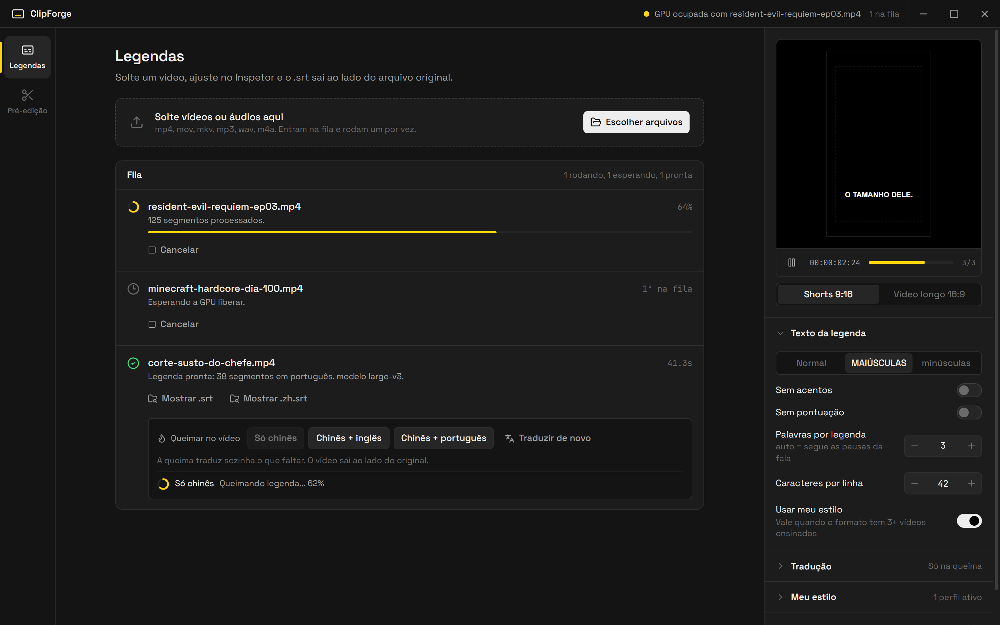
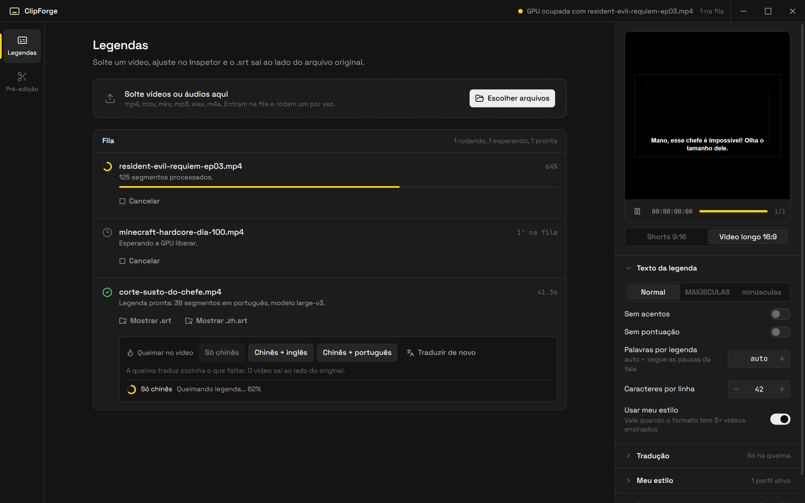
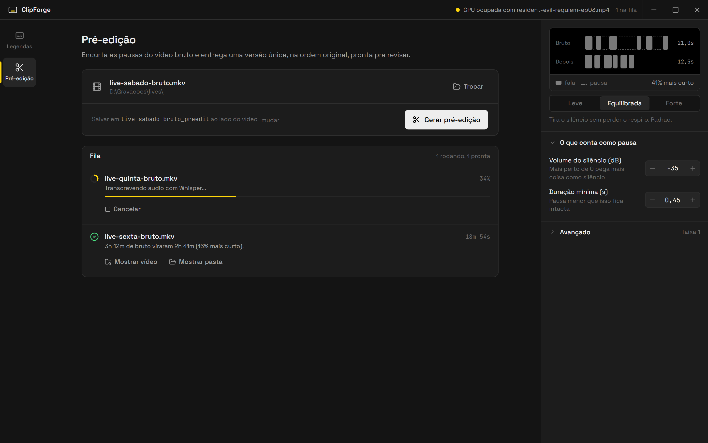
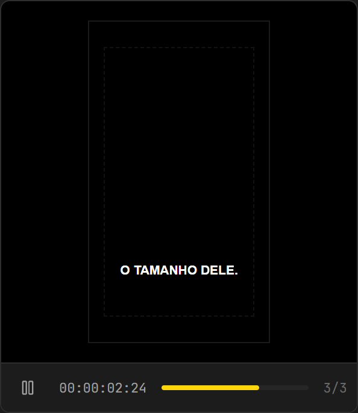

<div align="center">
  

  <h1>ClipForge</h1>

  <p><strong>Aplicativo desktop de edicao para creators, focado em acelerar cortes e legendas.</strong></p>

  <p>
    
    
    
    
  </p>
</div>

<p align="center">
  
</p>

---

## Sobre

O **ClipForge** e um app desktop feito com Electron, React e TypeScript para centralizar ferramentas locais de edicao usadas no workflow de criadores.

O escopo atual e simples: preparar material bruto com rapidez, gerar legendas e apoiar futuras ferramentas de edicao. Modulos comerciais e de inteligencia de parcerias foram separados do ClipForge.

## Funcionalidades

| Modulo | Status | O que faz |
| --- | --- | --- |
| **Legendas** (SubtitleForge) | Estavel | Transcreve audio/video com Whisper e gera arquivos `.srt`. |
| **Pre-edicao** (Pre-Editor) | Em evolucao | Pre-edita videos brutos, comprime pausas e gera uma versao longa mais rapida de revisar. |

## Interface

A interface segue o desenho de um editor de video: barra de titulo com o estado da fila de GPU, trilho de ferramentas a esquerda, fila no centro e um **Inspetor** fixo a direita, com as opcoes em secoes recolhiveis (secao fechada mostra o resumo dos valores atuais). Paineis grafite, preto puro so no monitor e o amarelo de legenda reservado pro que esta acontecendo agora: progresso, item ativo, agulha da previa.

| Legendas | Pre-edicao |
| --- | --- |
|  |  |



- **Monitor de previa (Legendas):** mostra uma frase de exemplo como ela vai sair, no formato escolhido (9:16 ou 16:9), na posicao da queima e com as opcoes de texto aplicadas: maiusculas/minusculas, acentos, pontuacao, palavras por legenda e caracteres por linha. A formatacao espelha o `render_srt` do Python (`src/lib/captionPreview.ts`, com testes). Troca de legenda como no video e tem pausa.
- **Diagrama de pausas (Pre-edicao):** o mesmo trecho de exemplo antes e depois, com os limites reais de cada tipo de pausa (`PREEDIT_MODE_SETTINGS`) pra intensidade escolhida: Leve, Equilibrada ou Forte (`src/lib/pausePreview.ts`).
- **Fila:** uma linha por arquivo, com anel de progresso, o que esta rodando e o que saiu. Legenda pronta ja mostra os botoes de queima; pre-edicao pronta mostra quanto o bruto encolheu.

<br clear="right" />

### Capturas de tela

As imagens deste README saem do proprio app em **modo demonstracao** (fila de exemplo, sem GPU nem video):

```bash
npm run screenshots
```

O script (`scripts/capture-screenshots.mjs`) sobe o Vite, abre o app com `?demo` numa janela escondida do Electron e salva PNG em 2x em `docs/screenshots/`. Pra ver a demo no navegador: `npm run dev` e abra `http://localhost:5173/?demo` (`?demo=clip-splitter` abre na Pre-edicao). O modo demo so existe em dev; o build de producao nao inclui nada dele.

### Traducao de legendas (SubtitleForge)

**Fluxo recomendado:** transcreva o video e clique em **"So chines"** (ou outro modo) no painel **Queimar no video** do item pronto na fila — a queima traduz sozinha o que faltar. As chaves **"Gerar .en.srt junto"** / **"Gerar .zh.srt junto"** (secao **Traducao** do Inspetor) sao opcionais: servem so pra ter o `arquivo.en.srt` / `arquivo.zh.srt` pronto logo na transcricao (ex.: pra revisar ou corrigir a mao antes de queimar).

A queima so reaproveita um `.zh.srt` existente se ele for **mais novo que o `cards.json`** da transcricao — traducao de uma transcricao anterior e gerada de novo, e correcao manual feita no `.zh.srt` depois da traducao e respeitada. Pra pedir uma traducao nova mesmo assim, use o botao **"Traduzir de novo"** no painel de queima: ele ignora o `.zh.srt` atual e gera outro **sem queimar**, pra dar pra revisar antes de clicar em "So chines". Se a validacao reprovar a traducao nova, o `.zh.srt` anterior continua intacto. Se a traducao falhar, a tarefa mostra um aviso em destaque com o motivo (a validacao nomeia grupo e regra). Os arquivos temporarios da queima (`.burn-N.ass`) sao apagados no fim.

Arquivos que aparecem ao lado do video: `.srt` (legenda original), `.cards.json` (tempos e confianca do Whisper, usado pela traducao), `.zh.srt` / `.en.srt` (traducoes), `.zh.REJEITADO.srt` (rascunho de traducao reprovada na validacao, so pra inspecao) e `.hardsub.<modo>.mp4` (video final).

- **Chines** usa um **LLM local via Ollama** (padrao `qwen2.5:14b-instruct`, custo zero, offline). Numa placa de 8GB o 14B roda parte na GPU e parte na RAM: um corte de ~40s leva ~7 min pra traduzir e o PC fica pesado nesse tempo. O `qwen2.5:7b-instruct` e ~2x mais rapido mas erra bem mais (troca personagem, inverte sentido) — use so se precisar de velocidade, com `CLIPFORGE_OLLAMA_MODEL=qwen2.5:7b-instruct`. Sem o Ollama rodando, a traducao pro chines falha com erro claro — nao cai em silencio no NLLB.
- **Ingles** usa o modelo NLLB (ctranslate2), que tambem pode ser forcado pro chines com `CLIPFORGE_TRANSLATION_ENGINE=nllb` (qualidade bem menor).

#### Chines: pipeline em dois estagios (LLM local)

Os cards de exibicao de um video vertical sao cortados a cada 2-3 palavras; traduzir card a card gera fragmento de frase, ordem de palavras do portugues e genero chutado. Por isso a traducao pro chines roda em dois estagios, ambos com a **transcricao inteira** (`arquivo.cards.json`, gravado pela transcricao com `segment_id` e `avg_logprob` de cada card):

1. **Glossario do video** (`glossary_service.build_video_glossary_llm`): o modelo recebe a transcricao inteira, o glossario do canal (travado) e o campo **"Tipo de video"** (secao Traducao do Inspetor; ex.: `gameplay de terror`, `corte engracado`, `reacao`), e devolve resumo da historia, personagens com genero/relacao/grafia chinesa fixa, termos recorrentes, registro adequado e os indices de cards ilegiveis.
2. **Traducao por frase** (`llm_translation.translate_with_llm`): o modelo recebe a transcricao inteira + o glossario e devolve **um objeto por frase**, agrupando cards consecutivos: `{"cards": [7, 8, 9], "start": 7.4, "end": 9.8, "zh": "...", "flag": ""}`. O `.zh.srt` final e montado a partir desses grupos, nao dos cards. Cards com `avg_logprob < -0.6` (Whisper inseguro) vao marcados como `low_confidence` pro modelo nao inventar texto no buraco.

As fronteiras de frase sao decididas pelo **Python**, nao pelo modelo (`llm_translation.propose_sentences`): ponto fecha sempre, virgula fecha a partir de 5 palavras, nunca corta antes de preposicao/conectivo nem num card terminado em palavra pendente, e frase com menos de 1,2s funde com a vizinha. O modelo traduz **uma frase por chamada**, vendo a transcricao inteira e as linhas ja traduzidas — deixa-lo agrupar e traduzir tudo de uma vez fazia o modelo de 7B resumir o video numa linha so ou deslocar o conteudo entre as frases.

Chamadas usam `temperature: 0` e saida JSON forcada. Resposta rejeitada (id errado, vazia, letra latina, longa demais, mesmo conectivo de abertura da linha anterior) volta pro modelo com o motivo e um pouco de temperatura (0 / 0,4 / 0,7) — com 0 ele repetiria a mesma resposta. Linha que passa de 20 caracteres e dividida em quantas legendas forem precisas, sempre na pontuacao chinesa, com o tempo repartido em fronteira de card. Pontuacao latina (`,` `.`) vira a de largura inteira (`，` `。`) e aspas/parenteses caem.

**Glossario persistente do canal** em `D:\Projetos\subtitle-forge\glossario_canal.json` (ver `DEFAULT_CHANNEL_GLOSSARY_PATH` em `python/glossary_service.py`): nome do canal, bordoes, personagens e jogos recorrentes. Entra no estagio 1 como **travado** — grafia que ja existe nunca e reescrita — e no fim do video as entradas novas sao fundidas nele. E um JSON simples, pode ser editado a mao pra corrigir uma grafia.

O campo **"Tipo de video"** tambem e repassado pela queima (hardsub), pra legenda gerada na hora da queima sair no mesmo registro da gerada na transcricao.

**Conferencia de sentido (pra quem nao le chines):** cada linha que passa nas regras e traduzida de volta pro portugues **as cegas** — o modelo ve so o chines, nao a fala original, senao "corrigiria" a retraducao e o erro sumiria. Se a fala tem negacao ("nao", "faltou", "nem"...) e a retraducao nao tem (ou o contrario), o sentido foi invertido e a linha volta pro modelo. Se continuar errada depois das tentativas, ela **nao reprova o video**: vai marcada pra revisao. A retraducao e a suspeita ficam em `arquivo.zh.review.json`, ao lado do `.zh.srt` (base da tela de revisao). Custo: ~2 chamadas a mais por frase. `CLIPFORGE_MEANING_CHECK=0` desliga. (Um "juiz" LLM comparando as frases foi testado e descartado: no 14B local errou 3 em 10 e levava ~40s por linha.)

**Validacao antes de gravar** (`subtitle_validation.py`, sem chamar API): todo card em exatamente um grupo e em ordem; nenhum caractere latino nem pontuacao latina na linha traduzida; no maximo 20 caracteres chineses por linha (video vertical); nenhum grupo com menos de 1,2s na tela; 她 com sujeito masculino / 他 com feminino; 嫁给 com sujeito masculino / 娶 com feminino, e 嫁给/娶 entre duas pessoas do mesmo genero (pede 和…结婚); nome com grafia divergente da canonica (variantes do glossario, canonico + sufixo tipo 埃德加尔, ultimo caractere trocado tipo 伯纳德/伯纳多); personagem trocado (a fonte cita um nome, a traducao usa outro no lugar); grupos com `flag` preenchido. Qualquer violacao **falha a traducao** apontando grupo e regra, grava o rascunho em `arquivo.zh.REJEITADO.srt` pra inspecao e nao funde o glossario do canal.

#### Instalando o Ollama

```bash
ollama pull qwen2.5:14b-instruct
```

Se o servidor local nao estiver rodando, o app sobe `ollama serve` sozinho em segundo plano (procura o executavel em `CLIPFORGE_OLLAMA_EXE`, no PATH, em `D:\Ollama\app` e na pasta padrao do instalador). Variaveis: `CLIPFORGE_OLLAMA_URL` (padrao `http://127.0.0.1:11434`), `CLIPFORGE_OLLAMA_MODEL` (padrao `qwen2.5:14b-instruct`). Pra guardar os modelos fora do `C:\Users\<usuario>\.ollama`, defina `OLLAMA_MODELS` (ex.: `D:\Projetos\subtitle-forge\models\ollama`) antes de subir o servidor.

#### Ingles / fallback: NLLB

O modelo NLLB precisa ser convertido pra ctranslate2 **localmente**, uma unica vez (mirrors prontos de terceiros no HuggingFace se mostraram instaveis — um foi removido, outro gerava traducao degenerada por tokenizer incompativel com os pesos). Com o ambiente do SubtitleForge ativado:

```bash
pip install transformers torch
ct2-transformers-converter --model facebook/nllb-200-distilled-600M --output_dir D:\Projetos\subtitle-forge\models\nllb-200-distilled-600M-ct2 --quantization int8 --copy_files sentencepiece.bpe.model
```

Isso baixa o modelo original do Facebook (~2,4GB) e gera a versao ctranslate2 em `D:\Projetos\subtitle-forge\models\nllb-200-distilled-600M-ct2` (caminho fixo, sem acento — sentencepiece nao le corretamente caminhos do Windows com caracteres acentuados, como `C:\Users\<usuario com acento>`). Depois da conversao, `transformers`/`torch` podem ser removidos; so `ctranslate2` e `sentencepiece` sao necessarios em tempo de execucao. Para usar outro caminho, defina `CLIPFORGE_NLLB_MODEL_DIR`.

No caminho NLLB a traducao agrupa os cards do mesmo segmento do Whisper e usa um glossario heuristico (nome capitalizado com frequencia >= 2, genero por artigo/concordancia) com pos-processamento de nome/pronome — bem mais fraco que o caminho LLM.

### Aprender o seu estilo de legenda (SubtitleForge)

O app aprende onde voce quebra as legendas e como ajusta entrada/saida, a partir dos videos que voce corrige no Premiere:

1. Gere a legenda no app (ela salva tambem `video.words.json`, com o tempo de cada palavra).
2. Corrija no Premiere e exporte o `.srt` corrigido e o video final (com os cortes).
3. Na secao **Meu estilo** do Inspetor, escolha video original, SRT corrigido e video final e clique **Ensinar**.

A comparacao e pelo texto (cortes de silencio nao atrapalham). Uma arvore de decisao (scikit-learn) aprende as quebras e medianas aprendem os tempos, com um perfil para vertical e outro para horizontal. Com 3+ videos ensinados no formato, a chave **Usar meu estilo** passa a segmentar novas legendas assim. Biblioteca em `%APPDATA%/<app>/subtitle-style` (cada video pode ser removido e o perfil e retreinado).

### Queima de legenda no video (hardsub)

Apos a transcricao de um video terminar, o SubtitleForge oferece 3 botoes pra gerar um arquivo de video final com a legenda queimada (hardsub): **"So chines"**, **"Chines + ingles"** e **"Chines + [idioma original]"** — as duas ultimas empilham 2 legendas no video (chines em cima), gerando a traducao que faltar automaticamente se ainda nao existir. O seletor **Formato** (Shorts 9:16 / Video longo 16:9), embaixo do monitor de previa, ajusta o tamanho de fonte e a segmentacao padrao (`maxWords`) pro tipo de video. O arquivo final sai como `video.hardsub.<modo>.mp4` ao lado do original.

Requisito: `ffmpeg`/`ffprobe` precisam estar instalados e acessiveis no PATH (ou em `C:\ffmpeg\bin`) — nao ha download automatico como o modelo Whisper/NLLB.

## Stack

- **Desktop:** Electron
- **Frontend:** React, TypeScript e Vite
- **Estilo:** Tailwind CSS
- **Estado:** Zustand
- **Icones:** Lucide React
- **Testes:** Vitest
- **Workers locais:** Python para transcricao e processamento de video

## Arquitetura

```text
Renderer React  <->  Electron main/preload  <->  Python workers
```

- **Renderer** (`src/`): UI React + Tailwind, estado via Zustand.
- **Main process** (`electron/`): IPC handlers, dialogs, janela e orquestracao de workers. Tudo que usa GPU (transcricao, queima e Pre-Editor) passa por uma fila unica (`electron/python/gpuQueue.ts`): um job por vez, pra nao disputar VRAM.
- **Workers Python** (`python/`): pipelines de legenda e corte.

## Pre-requisitos

- Node.js 22+
- npm 10+
- Python 3.10+
- FFmpeg e FFprobe disponiveis no sistema
- GPU NVIDIA com CUDA e opcional, mas recomendada para transcricao com Whisper

## Configuracao

Tudo tem padrao e funciona sem configurar nada. Pra mudar, defina **variaveis de ambiente do sistema** (o app nao le arquivo `.env`) e reabra o terminal/app depois. Exemplo no Windows:

```bash
setx CLIPFORGE_OLLAMA_MODEL qwen2.5:7b-instruct
```

Variaveis opcionais:

- `CLIPFORGE_SUBTITLE_FORGE_PATH`: caminho do ambiente Python usado pelo SubtitleForge.
- `CLIPFORGE_NLLB_MODEL_DIR`: caminho do modelo NLLB ja convertido pra ctranslate2 (ver secao "Traducao de legendas" acima). Padrao: `D:\Projetos\subtitle-forge\models\nllb-200-distilled-600M-ct2`.
- `CLIPFORGE_OLLAMA_URL` / `CLIPFORGE_OLLAMA_MODEL`: servidor e modelo do LLM local usado na traducao pro chines. Padrao: `http://127.0.0.1:11434` / `qwen2.5:14b-instruct`.
- `CLIPFORGE_TRANSLATION_ENGINE`: `auto` (padrao, LLM pro chines), `nllb` (forca o NLLB tambem pro chines).
- `CLIPFORGE_CLIP_SPLITTER_PATH`: caminho do projeto externo usado pelo Pre-Editor.
- `CLIPFORGE_TEMP`: pasta temporaria curta usada pelo Pre-Editor (ex.: `D:\cs_tmp`). Evita [WinError 206] quando o input/output esta em caminho profundo. Se nao definido, o app tenta `<drive>:\cs_tmp` e cai para a pasta do video como fallback.

## Instalacao

```bash
npm install
```

Dependencias Python (no venv usado pelo app, por padrao `D:\Projetos\subtitle-forge\.venv`):

```bash
D:\Projetos\subtitle-forge\.venv\Scripts\python.exe -m pip install -r python/requirements.txt
```

## Desenvolvimento

```bash
npm run electron:dev
```

Esse comando inicia o Vite, compila o processo principal do Electron em modo watch e abre o aplicativo desktop.

## Scripts

| Comando | Descricao |
| --- | --- |
| `npm run dev` | Inicia apenas o renderer com Vite. |
| `npm run electron:dev` | Inicia o app completo em modo desenvolvimento. |
| `npm run build` | Compila renderer e processo principal. |
| `npm run electron:build` | Gera build do app Electron. |
| `npm test` | Executa a suite de testes com Vitest. |
| `npm run test:watch` | Executa os testes em modo watch. |
| `npm run test:py` | Executa os testes Python (`python/*_test.py`) com o Python do app. `npm run test:py -- srt` roda so `srt*_test.py`. |
| `npm run test:all` | Vitest + testes Python. |
| `npm run screenshots` | Gera as imagens do README em `docs/screenshots/` (modo demonstracao). |

## Estrutura

```text
clip-forge/
├─ electron/             # Processo principal, preload e handlers IPC
│  ├─ ipc/               # Handlers IPC (subtitle, subtitleBurn, clipSplitter)
│  ├─ python/            # Runner Python, leitura de eventos e fila unica de GPU
│  └─ testing/           # Processo falso e utilitarios dos testes de IPC
├─ python/               # Workers locais (faster-whisper, FFmpeg) + modulos puros
│  ├─ events.py          # Protocolo de eventos JSON com o Electron
│  ├─ text_utils.py      # Helpers de texto (limpeza, timestamps, quebra de linha)
│  ├─ segmentation.py    # Palavras do Whisper -> legendas (cards)
│  ├─ style_*.py         # Aprendizado do estilo (alinhamento, features, arvore, biblioteca, servico)
│  └─ requirements.txt   # Dependencias Python fixadas
├─ resources/            # Icones do aplicativo
├─ scripts/              # Scripts utilitarios (inclui a captura das telas do README)
├─ src/
│  ├─ components/
│  │  ├─ clipSplitter/   # Pre-edicao: video bruto, diagrama de pausas, fila
│  │  ├─ inspector/      # Secoes recolhiveis e campos do Inspetor
│  │  ├─ layout/         # Barra de titulo, trilho de ferramentas e area de trabalho
│  │  ├─ subtitle/       # Legendas: monitor de previa, fila, queima, meu estilo
│  │  └─ ui/             # Botao, select, stepper, controle segmentado, status
│  ├─ demo/              # Modo demonstracao (so em dev, ?demo)
│  ├─ hooks/             # Hooks que conectam UI ao Electron
│  ├─ lib/               # Logica pura com testes (previa da legenda, pausas, fila)
│  ├─ pages/             # Telas das ferramentas de edicao
│  ├─ store/             # Estado global Zustand
│  └─ types/             # Contratos TypeScript compartilhados
└─ docs/                 # Documentacao tecnica, referencias legadas e screenshots/
```

## Modulos legados

Modulos fora do escopo atual foram removidos do shell ativo. Veja [docs/legacy_modules.md](docs/legacy_modules.md) para referencia historica.

## Seguranca

Reporte vulnerabilidades conforme [SECURITY.md](SECURITY.md).

## Licenca

[MIT](LICENSE) © 2026 Joao Pedro Costa e Silva
